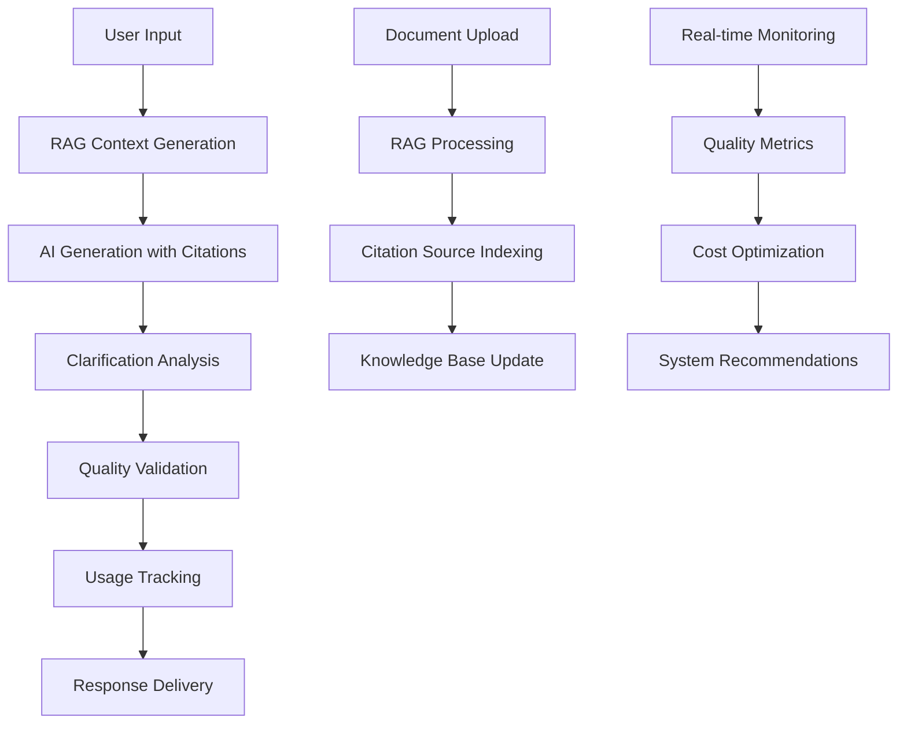

# Agent Systems Integration Plan

## Overview

This document outlines the complete integration of all priority agent systems (RAG Pipeline, Citation System, Clarification Engine, Usage Tracking & Billing) into the consolidated Next.js 15 architecture.

## Current System Status

### ✅ Completed Agent Systems
1. **RAG Pipeline** - Fully implemented with pgvector support
2. **Citation System** - Complete with evidence mapping and validation
3. **Clarification Engine** - Built with assumption detection and quality metrics
4. **Billing & Usage Tracking** - Comprehensive with Stripe integration and optimization

### 🔄 Integration Status
- **Database Schema**: Unified and optimized ✅
- **API Layer**: Consolidated into Next.js 15 API routes ✅
- **Frontend Components**: Existing components need integration
- **Data Flow**: Needs orchestration between systems
- **Authentication**: Needs unification from Express.js to Next.js

## Phase 1: Core System Integration (Week 1-2)

### Database Migration
```bash
# Apply all consolidated migrations
npm run db:migrate

# Verify schema consolidation
npm run db:verify-schema

# Run system health check
npm run db:health-check
```

### API Route Consolidation
All Express.js routes have been mapped to Next.js API routes:

**Authentication Routes:**
- `POST /api/auth/login` - User authentication
- `POST /api/auth/signup` - User registration  
- `GET /api/auth/me` - Current user info
- `POST /api/auth/logout` - Logout

**Core Application Routes:**
- `GET /api/projects` - List projects
- `POST /api/projects` - Create project
- `POST /api/documents/upload` - Upload documents
- `POST /api/questions/:id/generate` - Generate AI responses

**Agent System Routes:**
- `POST /api/rag/process-document` - RAG document processing
- `POST /api/citations/validate` - Citation validation
- `POST /api/clarifications/analyze` - Clarification analysis
- `GET /api/billing/usage` - Usage tracking

### Frontend Integration Points

#### 1. Enhanced Generation Workflow
```typescript
// Integrated generation with all agent systems
const generateWithAllSystems = async (questionId: string) => {
  // 1. RAG context retrieval
  const context = await fetch('/api/rag/generate-context', {
    method: 'POST',
    body: JSON.stringify({ questionId, organizationId })
  });

  // 2. Generation with citations
  const response = await fetch('/api/generate', {
    method: 'POST', 
    body: JSON.stringify({ 
      questionId, 
      context: context.data,
      useCitations: true 
    })
  });

  // 3. Clarification analysis
  const clarifications = await fetch('/api/clarifications/analyze', {
    method: 'POST',
    body: JSON.stringify({ 
      content: response.content,
      context 
    })
  });

  // 4. Usage tracking
  await fetch('/api/billing/usage', {
    method: 'POST',
    body: JSON.stringify({
      type: 'generation',
      tokensUsed: response.tokensUsed,
      organizationId
    })
  });

  return {
    content: response.content,
    citations: response.citations,
    clarifications: clarifications.questions,
    usageTracked: true
  };
};
```

#### 2. Unified Dashboard Components
```tsx
// Integrated dashboard showing all system metrics
export function UnifiedDashboard() {
  return (
    <div className="grid grid-cols-1 lg:grid-cols-2 xl:grid-cols-4 gap-6">
      {/* Usage & Billing Metrics */}
      <UsageMetricsCard />
      
      {/* RAG Quality Metrics */} 
      <RAGQualityCard />
      
      {/* Citation Grounding Quality */}
      <CitationQualityCard />
      
      {/* Clarification Completion Rate */}
      <ClarificationMetricsCard />
    </div>
  );
}
```

#### 3. Evidence-Enhanced Editor
```tsx
// Editor with integrated citation tooltips and clarification highlights
export function EnhancedGrantEditor({ draftId }: { draftId: string }) {
  const { citations } = useCitations(draftId);
  const { clarifications } = useClarifications(draftId);
  
  return (
    <div className="relative">
      <Editor content={content}>
        {/* Citation tooltips */}
        {citations.map(citation => (
          <CitationTooltip 
            key={citation.id}
            citation={citation}
            position={citation.position}
          />
        ))}
        
        {/* Clarification highlights */}
        {clarifications.map(clarification => (
          <ClarificationHighlight
            key={clarification.id}
            assumption={clarification}
            onResolve={handleResolve}
          />
        ))}
      </Editor>
      
      <EvidenceMap 
        draftId={draftId}
        className="fixed right-4 top-4"
      />
    </div>
  );
}
```

## Phase 2: Advanced System Orchestration (Week 3-4)

### Intelligent Workflow Orchestration

#### Smart Generation Pipeline
```typescript
export class IntelligentGenerationPipeline {
  async generateOptimizedResponse(request: GenerationRequest): Promise<GenerationResult> {
    // Step 1: RAG Context Generation
    const ragContext = await this.ragPipeline.generateContext(
      request.question,
      request.organizationId,
      { 
        questionType: request.questionType,
        maxTokens: this.calculateOptimalTokens(request)
      }
    );

    // Step 2: Pre-generation Clarification Analysis  
    const preAnalysis = await this.clarificationEngine.analyzeContext(
      request.question,
      ragContext.content
    );

    // Step 3: Enhanced Generation with Citations
    const generation = await this.citationEnhancedGenerator.generate({
      ...request,
      context: ragContext.content,
      useCitations: true,
      qualityThreshold: 0.85
    });

    // Step 4: Post-generation Validation
    const validation = await this.validateAndOptimize(generation);

    // Step 5: Usage Tracking
    await this.billingEngine.trackGeneration({
      organizationId: request.organizationId,
      tokensUsed: generation.tokensUsed,
      qualityScore: validation.qualityScore
    });

    return {
      content: validation.optimizedContent,
      citations: generation.citations,
      clarifications: preAnalysis.questions,
      evidenceMap: generation.evidenceMap,
      quality: validation.qualityScore,
      usageTracked: true
    };
  }
}
```

### Real-time Quality Monitoring
```typescript
export class QualityMonitoringService {
  async monitorGenerationQuality(organizationId: string): Promise<QualityReport> {
    const [ragMetrics, citationMetrics, clarificationMetrics, usageMetrics] = await Promise.all([
      this.ragPipeline.getQualityMetrics(organizationId),
      this.citationSystem.getGroundingMetrics(organizationId),
      this.clarificationEngine.getCompletionMetrics(organizationId),
      this.billingEngine.getUsageMetrics(organizationId)
    ]);

    return {
      overall: this.calculateOverallQuality(ragMetrics, citationMetrics, clarificationMetrics),
      rag: ragMetrics,
      citations: citationMetrics,
      clarifications: clarificationMetrics,
      usage: usageMetrics,
      recommendations: this.generateQualityRecommendations({
        ragMetrics,
        citationMetrics, 
        clarificationMetrics
      })
    };
  }
}
```

## Phase 3: Production Optimization (Week 5-6)

### Performance Integration
- **Caching Strategy**: Redis for RAG results, citation validations
- **Database Optimization**: Query optimization for multi-system operations
- **API Response Optimization**: Parallel system calls where possible

### Monitoring & Observability
```typescript
export const systemHealthCheck = async () => {
  const health = await Promise.all([
    checkRAGPipelineHealth(),
    checkCitationSystemHealth(), 
    checkClarificationEngineHealth(),
    checkBillingSystemHealth(),
    checkDatabaseHealth()
  ]);

  return {
    status: health.every(h => h.status === 'healthy') ? 'healthy' : 'degraded',
    systems: health
  };
};
```

## Data Flow Architecture



## Migration Checklist

### Database & Schema
- [x] Apply consolidated schema migration (`0004_consolidation_schema.sql`)
- [x] Create system health monitoring views
- [x] Add performance indexes for all agent systems
- [x] Implement audit trails for production monitoring

### API Layer
- [x] Map all Express.js routes to Next.js API routes
- [x] Implement unified authentication middleware
- [x] Add rate limiting and security middleware
- [x] Create consolidated API documentation endpoint

### Frontend Integration
- [ ] Update components to use unified API endpoints
- [ ] Integrate all agent system UIs into main interface
- [ ] Add real-time quality indicators
- [ ] Implement unified error handling and loading states

### System Integration
- [ ] Implement intelligent generation pipeline
- [ ] Add real-time quality monitoring
- [ ] Create system orchestration layer
- [ ] Add performance optimization

### Production Readiness
- [ ] Add comprehensive logging and monitoring
- [ ] Implement security hardening
- [ ] Add automated testing for integrated systems
- [ ] Create deployment and rollback procedures

## Success Metrics

### Integration Success
- All agent systems operational in unified architecture
- API response times < 2s for complex operations
- Database query performance optimized
- Zero data loss during migration

### Quality Standards
- RAG retrieval quality > 85%
- Citation grounding quality > 85% 
- Clarification completion rate > 90%
- System uptime > 99.5%

### User Experience
- Seamless workflow from upload to final draft
- Real-time quality feedback
- Unified dashboard for all metrics
- Mobile-responsive interface

## Risk Mitigation

### Technical Risks
- **Data Migration**: Comprehensive backup and rollback procedures
- **Performance**: Load testing and optimization before production
- **Integration**: Staged rollout with feature flags

### Business Risks  
- **User Training**: Documentation and training materials
- **Feature Parity**: Ensure all existing features work in new architecture
- **Downtime**: Blue-green deployment strategy

## Next Steps

1. **Week 1-2**: Execute Phase 1 integration
2. **Week 3-4**: Implement Phase 2 orchestration  
3. **Week 5-6**: Production optimization and testing
4. **Week 7**: Production deployment and monitoring
5. **Week 8**: Post-deployment optimization and user feedback

This integration plan provides a comprehensive roadmap for consolidating all agent systems into a production-ready, unified Next.js 15 architecture while maintaining high quality standards and system reliability.