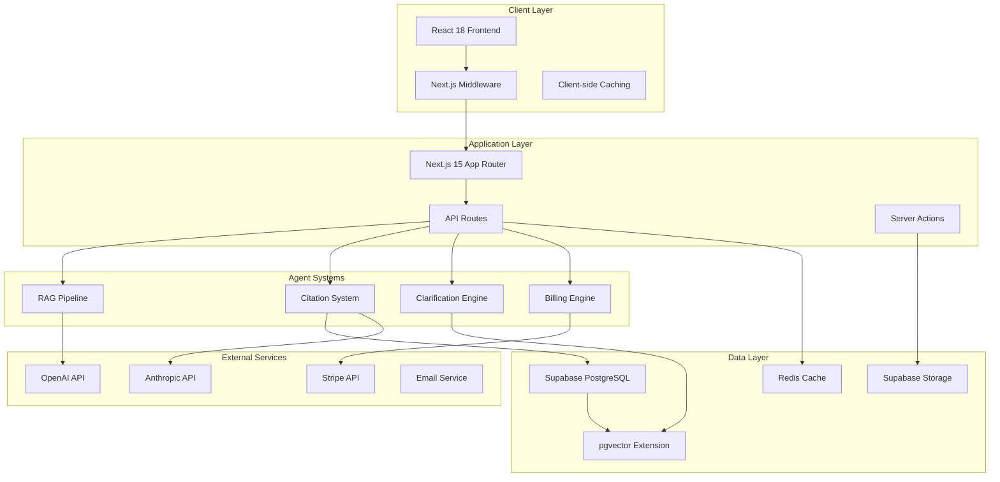

# Production Deployment Architecture

## Executive Summary

This document outlines the production-ready architecture for Granted AI, consolidating all agent systems (RAG Pipeline, Citation System, Clarification Engine, Usage Tracking & Billing) into a scalable, secure, and high-performance Next.js 15 platform.

## Architecture Decision Summary

### ✅ **PRIMARY ARCHITECTURE: Next.js 15 with Supabase**

**Technology Stack:**
- **Frontend/Backend**: Next.js 15 with App Router
- **Database**: Supabase PostgreSQL with pgvector extension
- **Authentication**: Next.js middleware with Supabase Auth
- **File Storage**: Supabase Storage
- **Hosting**: Vercel (recommended) or self-hosted
- **AI Providers**: OpenAI & Anthropic with fallback support
- **Billing**: Stripe integration
- **Monitoring**: Vercel Analytics + Custom metrics

## System Architecture Diagram



## Deployment Configuration

### Environment Configuration

```bash
# Production Environment Variables
NODE_ENV=production
NEXT_PUBLIC_APP_URL=https://granted.ai

# Database Configuration
DATABASE_URL=postgresql://...
NEXT_PUBLIC_SUPABASE_URL=https://your-project.supabase.co
NEXT_PUBLIC_SUPABASE_ANON_KEY=eyJ...
SUPABASE_SERVICE_ROLE_KEY=eyJ...

# AI Providers
OPENAI_API_KEY=sk-proj-...
ANTHROPIC_API_KEY=sk-ant-...
GRANTED_DEFAULT_PROVIDER=openai

# Billing & Payments
STRIPE_SECRET_KEY=sk_live_...
STRIPE_PUBLISHABLE_KEY=pk_live_...
STRIPE_WEBHOOK_SECRET=whsec_...

# Monitoring & Analytics
VERCEL_ANALYTICS_ID=...
SENTRY_DSN=https://...

# Redis Cache (Optional)
REDIS_URL=redis://...

# Security
NEXTAUTH_SECRET=your-super-secret-key
NEXTAUTH_URL=https://granted.ai
```

### Next.js Configuration (`next.config.ts`)

```typescript
import type { NextConfig } from "next";

const nextConfig: NextConfig = {
  // Performance optimizations
  experimental: {
    ppr: true, // Partial Pre-rendering
    reactCompiler: true,
  },
  
  // Production optimizations
  compress: true,
  poweredByHeader: false,
  
  // Image optimization
  images: {
    domains: ['your-supabase-project.supabase.co'],
    formats: ['image/webp', 'image/avif'],
  },
  
  // Security headers
  async headers() {
    return [
      {
        source: '/(.*)',
        headers: [
          {
            key: 'X-Frame-Options',
            value: 'DENY',
          },
          {
            key: 'X-Content-Type-Options', 
            value: 'nosniff',
          },
          {
            key: 'Referrer-Policy',
            value: 'strict-origin-when-cross-origin',
          },
          {
            key: 'Permissions-Policy',
            value: 'camera=(), microphone=(), geolocation=()',
          },
        ],
      },
    ];
  },
  
  // API route configuration
  async rewrites() {
    return [
      {
        source: '/api/health',
        destination: '/api/health/route',
      },
    ];
  },
};

export default nextConfig;
```

## Database Architecture

### Production Database Setup

```sql
-- Production database configuration
-- Enable required extensions
CREATE EXTENSION IF NOT EXISTS "uuid-ossp";
CREATE EXTENSION IF NOT EXISTS "vector";
CREATE EXTENSION IF NOT EXISTS "pg_stat_statements";

-- Create optimized indexes for production
CREATE INDEX CONCURRENTLY IF NOT EXISTS "idx_documents_org_processed" 
ON documents(organization_id, processed) WHERE processed = true;

CREATE INDEX CONCURRENTLY IF NOT EXISTS "idx_doc_chunks_embedding" 
ON doc_chunks USING ivfflat (embedding vector_cosine_ops) WITH (lists = 100);

CREATE INDEX CONCURRENTLY IF NOT EXISTS "idx_usage_events_org_date" 
ON usage_events(organization_id, created_at DESC);

CREATE INDEX CONCURRENTLY IF NOT EXISTS "idx_projects_user_status" 
ON projects(user_id, status);

-- Add production monitoring
CREATE OR REPLACE VIEW production_health AS
SELECT 
  'database' as component,
  CASE 
    WHEN pg_is_in_recovery() THEN 'replica'
    ELSE 'primary'
  END as role,
  pg_database_size(current_database()) as db_size_bytes,
  (SELECT count(*) FROM pg_stat_activity WHERE state = 'active') as active_connections,
  current_timestamp as checked_at;

-- Production backup configuration
-- Run daily backups with point-in-time recovery
-- Retention: 30 days for daily, 12 months for monthly
```

### Connection Pooling

```typescript
// Database connection with pooling for production
import { createClient } from '@supabase/supabase-js';

const supabaseUrl = process.env.NEXT_PUBLIC_SUPABASE_URL!;
const supabaseServiceKey = process.env.SUPABASE_SERVICE_ROLE_KEY!;

export const supabase = createClient(supabaseUrl, supabaseServiceKey, {
  db: {
    schema: 'public',
  },
  auth: {
    persistSession: false,
  },
  realtime: {
    enabled: false, // Disable for API routes
  },
});

// Connection pool for high-throughput operations
export const supabasePool = createClient(supabaseUrl, supabaseServiceKey, {
  db: {
    schema: 'public',
  },
  auth: {
    persistSession: false,
  },
  pool: {
    max: 20,
    min: 5,
    idle: 10000,
  },
});
```

## Scalability & Performance

### Caching Strategy

```typescript
// Multi-level caching strategy
import { Redis } from '@upstash/redis';

const redis = new Redis({
  url: process.env.REDIS_URL!,
  token: process.env.REDIS_TOKEN!,
});

export class ProductionCacheManager {
  // Level 1: In-memory caching for frequently accessed data
  private memoryCache = new Map<string, { data: any; expires: number }>();

  // Level 2: Redis for shared caching across instances  
  async get(key: string): Promise<any> {
    // Check memory cache first
    const memoryItem = this.memoryCache.get(key);
    if (memoryItem && memoryItem.expires > Date.now()) {
      return memoryItem.data;
    }

    // Check Redis cache
    const redisData = await redis.get(key);
    if (redisData) {
      // Store in memory cache for next time
      this.memoryCache.set(key, {
        data: redisData,
        expires: Date.now() + 300000 // 5 minutes
      });
      return redisData;
    }

    return null;
  }

  async set(key: string, data: any, ttlSeconds: number = 3600): Promise<void> {
    // Set in Redis with TTL
    await redis.setex(key, ttlSeconds, JSON.stringify(data));
    
    // Set in memory cache
    this.memoryCache.set(key, {
      data,
      expires: Date.now() + Math.min(ttlSeconds * 1000, 300000)
    });
  }
}

export const cacheManager = new ProductionCacheManager();
```

### Rate Limiting & Security

```typescript
// API rate limiting middleware
import { Ratelimit } from "@upstash/ratelimit";
import { Redis } from "@upstash/redis";

const ratelimit = new Ratelimit({
  redis: Redis.fromEnv(),
  limiter: Ratelimit.slidingWindow(100, "1 m"), // 100 requests per minute
  analytics: true,
});

export async function withRateLimit(request: Request) {
  const ip = request.headers.get("x-forwarded-for") ?? "127.0.0.1";
  const { success, pending, limit, reset, remaining } = await ratelimit.limit(ip);

  if (!success) {
    throw new Error("Rate limit exceeded");
  }

  return { success, pending, limit, reset, remaining };
}

// Security middleware
export function withSecurity() {
  return {
    headers: {
      'Strict-Transport-Security': 'max-age=31536000; includeSubDomains',
      'X-Content-Type-Options': 'nosniff',
      'X-Frame-Options': 'DENY',
      'X-XSS-Protection': '1; mode=block',
    }
  };
}
```

## Monitoring & Observability

### Health Check System

```typescript
// Production health monitoring
export async function GET() {
  const healthChecks = await Promise.allSettled([
    checkDatabaseHealth(),
    checkSupabaseHealth(), 
    checkAIProviderHealth(),
    checkRedisHealth(),
    checkStripeHealth(),
  ]);

  const results = healthChecks.map((result, index) => ({
    service: ['database', 'supabase', 'ai_providers', 'redis', 'stripe'][index],
    status: result.status === 'fulfilled' ? 'healthy' : 'unhealthy',
    details: result.status === 'fulfilled' ? result.value : result.reason,
  }));

  const overallStatus = results.every(r => r.status === 'healthy') 
    ? 'healthy' 
    : 'degraded';

  return NextResponse.json({
    status: overallStatus,
    timestamp: new Date().toISOString(),
    services: results,
    uptime: process.uptime(),
    memory: process.memoryUsage(),
  });
}

async function checkDatabaseHealth() {
  const start = Date.now();
  const result = await supabase
    .from('system_config')
    .select('key')
    .limit(1);
    
  return {
    responsive: true,
    latency: Date.now() - start,
    connections: 'healthy',
  };
}
```

### Performance Monitoring

```typescript
// Custom metrics collection
export class MetricsCollector {
  async recordAPICall(endpoint: string, duration: number, status: number) {
    await supabase
      .from('api_metrics')
      .insert({
        endpoint,
        duration_ms: duration,
        status_code: status,
        timestamp: new Date(),
      });
  }

  async recordAIGeneration(provider: string, tokens: number, cost: number) {
    await supabase
      .from('ai_metrics')
      .insert({
        provider,
        tokens_used: tokens,
        cost_cents: cost,
        timestamp: new Date(),
      });
  }

  async getSystemMetrics(timeframe: '1h' | '24h' | '7d' = '24h') {
    const interval = {
      '1h': '1 hour',
      '24h': '24 hours', 
      '7d': '7 days',
    }[timeframe];

    const { data } = await supabase
      .rpc('get_system_metrics', { 
        time_interval: interval 
      });

    return data;
  }
}

export const metrics = new MetricsCollector();
```

## Deployment Options

### Option 1: Vercel (Recommended)

**Advantages:**
- Zero-config deployment
- Automatic scaling
- Edge functions for global performance
- Built-in analytics and monitoring
- Seamless Next.js integration

**Configuration:**
```json
// vercel.json
{
  "functions": {
    "src/app/api/**/*.ts": {
      "maxDuration": 300
    }
  },
  "regions": ["iad1", "sfo1"],
  "env": {
    "NODE_ENV": "production"
  }
}
```

### Option 2: Self-Hosted Docker

```dockerfile
# Production Dockerfile
FROM node:18-alpine AS base
WORKDIR /app
COPY package*.json ./
RUN npm ci --only=production && npm cache clean --force

FROM node:18-alpine AS build
WORKDIR /app
COPY . .
RUN npm ci && npm run build

FROM node:18-alpine AS production
WORKDIR /app
COPY --from=base /app/node_modules ./node_modules
COPY --from=build /app/.next ./.next
COPY --from=build /app/public ./public
COPY --from=build /app/package.json ./package.json

EXPOSE 3000
CMD ["npm", "start"]
```

```yaml
# docker-compose.yml for production
version: '3.8'
services:
  app:
    build: .
    ports:
      - "3000:3000"
    environment:
      - NODE_ENV=production
      - DATABASE_URL=${DATABASE_URL}
      - NEXTAUTH_SECRET=${NEXTAUTH_SECRET}
    restart: unless-stopped
    
  nginx:
    image: nginx:alpine
    ports:
      - "80:80"
      - "443:443"
    volumes:
      - ./nginx.conf:/etc/nginx/nginx.conf
      - ./ssl:/etc/nginx/ssl
    depends_on:
      - app
    restart: unless-stopped
```

## Security Hardening

### Authentication & Authorization

```typescript
// Production authentication middleware
export async function verifyAuth(request: Request) {
  const token = request.headers.get('authorization')?.replace('Bearer ', '');
  
  if (!token) {
    throw new Error('Authentication required');
  }

  const { data: user, error } = await supabase.auth.getUser(token);
  
  if (error || !user) {
    throw new Error('Invalid token');
  }

  return user;
}

// RBAC implementation
export async function checkPermission(userId: string, action: string, resource: string) {
  const { data: permissions } = await supabase
    .from('user_permissions')
    .select('actions')
    .eq('user_id', userId)
    .eq('resource', resource)
    .single();

  return permissions?.actions?.includes(action) ?? false;
}
```

### Data Protection

```typescript
// Data encryption for sensitive fields
import { encrypt, decrypt } from './encryption';

export async function storeSecureDocument(documentData: any) {
  const encryptedContent = await encrypt(documentData.content);
  
  return await supabase
    .from('documents')
    .insert({
      ...documentData,
      content: encryptedContent,
      encrypted: true,
    });
}
```

## Backup & Disaster Recovery

### Automated Backup Strategy

```bash
#!/bin/bash
# Production backup script
DATE=$(date +%Y%m%d_%H%M%S)
BACKUP_DIR="/backups/granted-ai"

# Database backup
pg_dump $DATABASE_URL > "$BACKUP_DIR/db_backup_$DATE.sql"

# File storage backup (Supabase Storage)
supabase storage download --all "$BACKUP_DIR/storage_$DATE/"

# Configuration backup
cp -r ./migrations "$BACKUP_DIR/migrations_$DATE/"

# Compress and upload to external storage
tar -czf "$BACKUP_DIR/full_backup_$DATE.tar.gz" \
  "$BACKUP_DIR/db_backup_$DATE.sql" \
  "$BACKUP_DIR/storage_$DATE/" \
  "$BACKUP_DIR/migrations_$DATE/"

# Upload to AWS S3 or similar
aws s3 cp "$BACKUP_DIR/full_backup_$DATE.tar.gz" \
  s3://granted-ai-backups/

# Cleanup old backups (keep 30 days)
find "$BACKUP_DIR" -name "*.tar.gz" -mtime +30 -delete
```

## Performance Benchmarks & SLAs

### Target Performance Metrics

| Metric | Target | Monitoring |
|--------|--------|------------|
| Page Load Time | < 2s | Real User Monitoring |
| API Response Time | < 1s | Custom metrics |
| AI Generation Time | < 30s | Agent system monitoring |
| Database Query Time | < 100ms | PostgreSQL logs |
| Uptime | > 99.5% | Health checks |
| Cache Hit Rate | > 80% | Redis metrics |

### Scaling Thresholds

```typescript
// Auto-scaling configuration
export const SCALING_THRESHOLDS = {
  database: {
    connections: 80, // Scale when > 80% of max connections
    cpu: 70, // Scale when CPU > 70%
    memory: 80, // Scale when memory > 80%
  },
  
  api: {
    responseTime: 2000, // Scale when avg response > 2s
    errorRate: 0.05, // Scale when error rate > 5%
    requestsPerMinute: 1000, // Scale when RPM > 1000
  },
  
  storage: {
    diskUsage: 85, // Alert when disk > 85%
    iops: 1000, // Scale when IOPS > 1000
  }
};
```

## Cost Optimization

### Resource Optimization Strategy

```typescript
// Cost monitoring and optimization
export class CostOptimizer {
  async analyzeUsageCosts(organizationId: string) {
    const costs = await supabase
      .rpc('calculate_organization_costs', { 
        org_id: organizationId,
        period: '30 days'
      });

    return {
      totalCost: costs.total_cost_cents,
      breakdown: {
        aiGeneration: costs.ai_cost,
        storage: costs.storage_cost,
        computeTime: costs.compute_cost,
      },
      recommendations: this.generateOptimizationTips(costs)
    };
  }

  private generateOptimizationTips(costs: any) {
    const tips = [];
    
    if (costs.ai_cost > costs.total_cost_cents * 0.6) {
      tips.push('Consider using more efficient AI models for routine tasks');
    }
    
    if (costs.storage_cost > costs.total_cost_cents * 0.3) {
      tips.push('Archive old documents to reduce storage costs');
    }
    
    return tips;
  }
}
```

## Migration Timeline & Checklist

### Pre-Production Checklist
- [ ] All migrations applied and tested
- [ ] Load testing completed (target: 1000 concurrent users)
- [ ] Security audit completed
- [ ] Backup and recovery procedures tested
- [ ] Monitoring and alerting configured
- [ ] SSL certificates installed and configured
- [ ] CDN configured for static assets
- [ ] Database performance optimized
- [ ] API rate limiting configured
- [ ] Error tracking and logging implemented

### Go-Live Checklist
- [ ] DNS configured and tested
- [ ] Production environment variables set
- [ ] Database connection pooling enabled
- [ ] Redis cache warmed up
- [ ] Health check endpoints responding
- [ ] Monitoring dashboards active
- [ ] Backup systems operational
- [ ] Support team notified and ready
- [ ] User communication sent
- [ ] Rollback procedure documented and ready

## Post-Deployment Optimization

### Week 1-2: Monitoring & Adjustment
- Monitor all system metrics closely
- Adjust scaling thresholds based on actual usage
- Optimize database queries based on performance logs
- Fine-tune caching strategies

### Month 1: Performance Optimization
- Analyze user behavior and optimize critical paths
- Implement additional caching layers if needed
- Optimize AI model usage based on cost analysis
- Consider edge deployment for global users

### Quarterly: Architecture Review
- Review system architecture for scalability improvements
- Evaluate new technologies and integrations
- Update security practices and audit results
- Plan for next phase of feature development

This production architecture provides a robust, scalable, and maintainable foundation for Granted AI, successfully consolidating all agent systems into a unified Next.js 15 platform ready for enterprise-scale deployment.